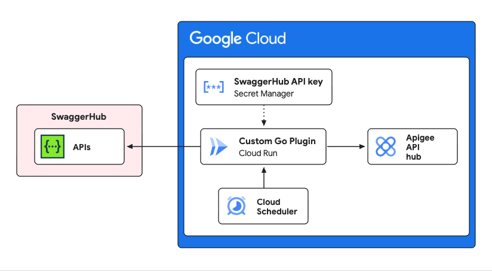

# Apigee API hub SwaggerHub Onramp Plugin

[Apigee API hub](https://docs.cloud.google.com/apigee/docs/apihub/what-is-api-hub) offers a [plugin](https://docs.cloud.google.com/apigee/docs/apihub/plugins) framework for ingesting API data from various sources. This [custom plugin](https://docs.cloud.google.com/apigee/docs/apihub/create-custom-plugins) implementation synchronizes API definitions from SmartBear's [SwaggerHub](https://swagger.io/product/) to the API hub.

This plugin implementation is written in [Go](https://go.dev/) and is designed to be deployed as a [Cloud Run](https://cloud.google.com/run) service.

## Details



-   Fetches API definitions from a specified SwaggerHub organization/owner.
-   Ingests the APIs into Apigee API hub using the `CollectApiData` function from the [Go client library for API hub](https://pkg.go.dev/cloud.google.com/go/apihub).
-   Automatically syncs every 5 minutes.
-   The SwaggerHub API key is securely stored in Google Cloud Secret Manager.

## Limitations

This implementation is currently only designed to import OpenAPI specifications from SwaggerHub. Future versions may support other formats.

SwaggerHub lacks the ability to configure a global webhook to notify when APIs are created, updated, or deleted, so this plugin uses a simple polling mechanism to sync APIs every 5 minutes.

This also means that the plugin cannot detect when APIs are deleted from SwaggerHub. However, using SwaggerHub's [email notifications](https://support.smartbear.com/swaggerhub/docs/en/get-email-notifications.html) plus automation tooling, it may be possible to create an email-to-webhook bridge to notify the plugin when APIs are deleted.

## Note about API hub fingerprints

When creating or importing APIs via the plugin framework, API hub uses the concept of a "fingerprint" to uniquely identify APIs. When a plugin source imports API data, the fingerprint provided is used to determine if the API is a new API, or an update to an existing API. If you have existing plugin sources configured in your API hub, you will need to ensure the fingerprint is consistent across all plugin sources to avoid duplicate APIs. You can use the `Fingerprint` property in the `APIMetadata` struct to define this. This implementation uses the API ID from SwaggerHub as the fingerprint.

> The [built-in API hub plugins](https://docs.cloud.google.com/apigee/docs/apihub/plugins#supported-plugins) for Apigee use the proxy name as the fingerprint. To override that behavior you may use a custom [Curation](https://docs.cloud.google.com/apigee/docs/apihub/curations) flow to set the desired fingerprint. 

## Prerequisites

-   A Google Cloud project with billing enabled.
-   Google Cloud SDK (`gcloud`) [installed](https://docs.cloud.google.com/sdk/docs/install) and authenticated.
-   `jq` installed for JSON parsing in deployment scripts.
-   An Apigee API hub instance provisioned in your GCP project. See provisioning instructions [here](https://docs.cloud.google.com/apigee/docs/apihub/provision).
-   A SwaggerHub account and API key. Free trials are available [here](https://try.platform.smartbear.com/?product=ApiHub).

## Configuration

If you have not already authenticated with the gcloud CLI, run:

```bash
gcloud auth login
```

Fill in the required environment variables in `env.sh`:

```bash
export GOOGLE_CLOUD_PROJECT="your-google-cloud-project"
export GOOGLE_CLOUD_REGION="us-central1"
export SWAGGERHUB_OWNER="your-swaggerhub-owner"
export SWAGGERHUB_API_KEY="your-swaggerhub-api-key"
```

## Deployment

To deploy the plugin and all required resources, run:

```bash
./deploy.sh
```

This script will:
- Enable necessary Google Cloud APIs.
- Create the Apigee API Hub plugin and plugin instance.
- Create a Secret Manager secret containing your SwaggerHub API key.
- Create a Service Account with necessary permissions.
- Build and deploy the Cloud Run service.
- Create a Cloud Scheduler job to trigger the sync every 5 minutes. You may adjust the [interval](https://docs.cloud.google.com/scheduler/docs/configuring/cron-job-schedules) as desired.

## Testing

To test the plugin, simply create a new API in SwaggerHub and wait for the sync to complete. You can check the status of the sync in the Cloud Scheduler job, or by checking the logs of the Cloud Run service. Once the sync is complete, you should see the APIs appear in your Apigee API hub catalog.

## Cleanup

To remove all resources created by this plugin, simply run:

```bash
./cleanup.sh
```

This will delete all resources created by the deployment script.

## Disclaimer

This is not an officially supported Google product, nor is it part of an official Google product.